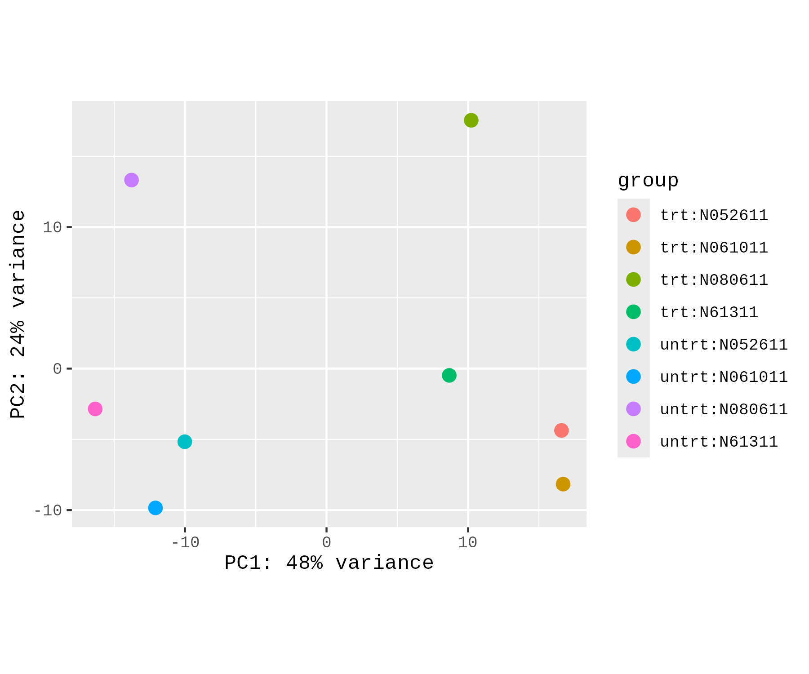
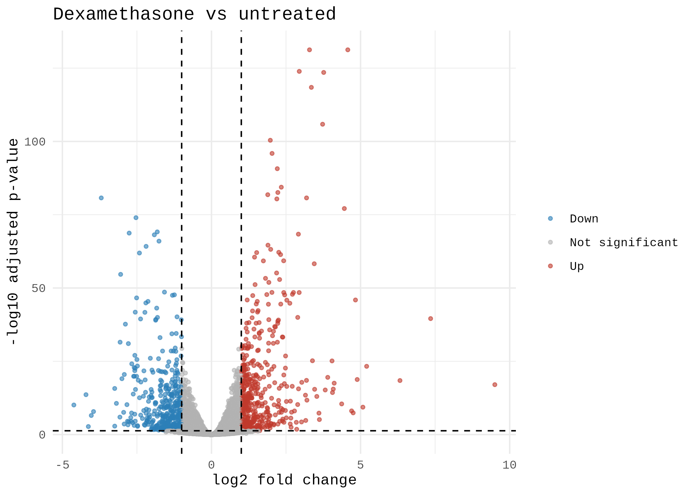
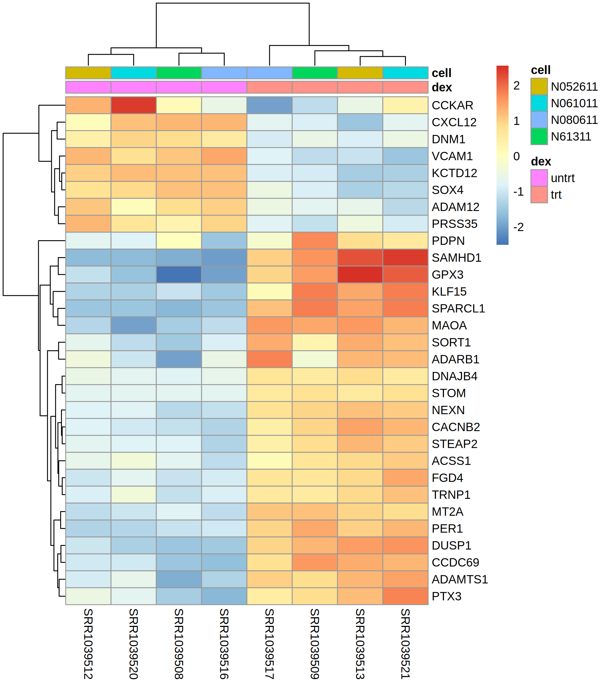

# RNASeq-DESeq2-demo
# RNA-seq Differential Expression with DESeq2

A reproducible R workflow: QC, differential expression, volcano plot and heatmap on a public dataset.

Built with AI assistance; I reviewed and tested the results.

## Dataset 
[The airway dataset (GEO: GSE52778): RNA-seq of human airway smooth muscle cells, comparing dexamethasone-treated with untreated samples across four donor cell lines. Loaded from the Bioconductor `airway` package as raw counts]
1. Raw counts loaded; genes with fewer than 10 counts in fewer than 4 samples removed.
2. DESeq2 model with design ~ cell + dex (accounts for the donor cell line).
3. QC: PCA on variance-stabilised counts.
4. Results: adjusted p-value < 0.05 and |log2 fold change| > 1.
5. Gene symbols mapped with org.Hs.eg.db.

## Results
- [number] genes significant at padj < 0.05 ([up] up, [down] down).
- Top genes: [list a few from your own table, e.g. the first five symbols].

  

## Limitations
Small sample size, a single cell type, and no independent validation. Differential expression here is a
hypothesis for follow-up, not proof.

## Files
deseq2_results_all.csv (full results), sessionInfo.txt (package versions).
